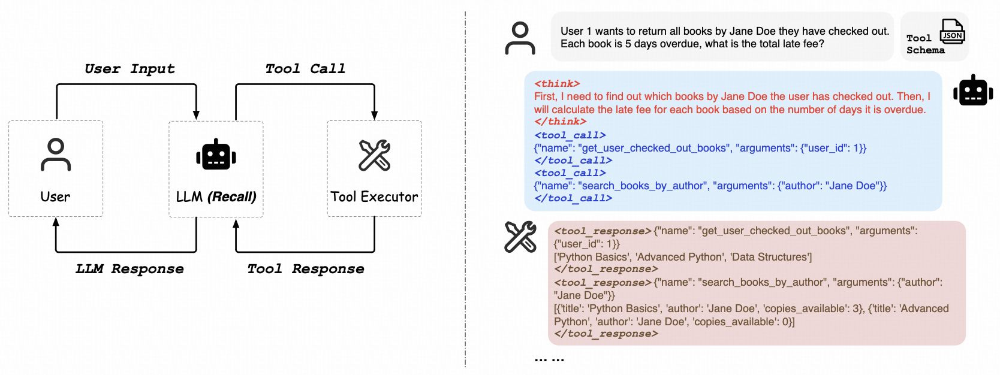
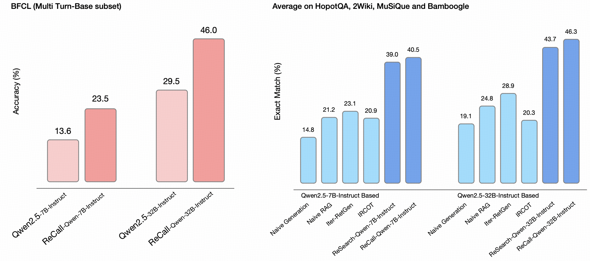

<div align="center">

# ***ReCall***: Learning to ***Re***ason with Tool ***Call*** for LLMs via Reinforcement Learning

[](https://attractive-almandine-935.notion.site/ReCall-Learning-to-Reason-with-Tool-Call-for-LLMs-via-Reinforcement-Learning-1d7aec91e9bb8006ad40f9edbfe2191a) [](https://arxiv.org/abs/2503.19470) [](https://huggingface.co/collections/agentrl/research-67e506a0311bea06dc54878b) 

</div>

We introduce ***ReCall***, a novel framework that trains LLMs to ***Re***ason with Tool ***Call*** via reinforcement learning—without requiring any supervised data on tool use trajectories or reasoning steps. *ReCall* empowers LLMs to agentically use and combine arbitrary tools like [OpenAI o3](https://openai.com/index/introducing-o3-and-o4-mini/), offering an accessible approach toward general-purpose agents. Additionally, we provide a novel perspective to generate synthetic data with diverse environments and complex multi-step tasks, enabling LLMs to develop sophisticated tool-based reasoning capabilities. This is a work in progress and we are actively working on it.

> [!IMPORTANT]
> *ReCall* is the successor to [*ReSearch*](https://arxiv.org/abs/2503.19470) and represents a more comprehensive framework that extends beyond the search tool to support reasoning with any user-defined tools. It can be a drop-in replacement of *ReSearch*. We've archived the original implementation of *ReSearch* in the branch `re-search`.

<p align="center">


</p>

## 📰 News
- **[2025-04-24]** 🎉 We release the first version of *ReCall*, and archive the original implementation of *ReSearch*.
  - ➡️ The name of the repository is changed from *ReSearch* to *ReCall*.
  - 📝 We release a [blog](https://attractive-almandine-935.notion.site/ReCall-Learning-to-Reason-with-Tool-Call-for-LLMs-via-Reinforcement-Learning-1d7aec91e9bb8006ad40f9edbfe2191a) to introduce the idea of *ReCall*.
  - 📦 Current implementation of *ReCall* is based on verl 0.3.0 + vllm 0.8.4.
- **[2025-03-27]** 🤗 We release our trained *ReSearch* models on [Hugging Face](https://huggingface.co/collections/agentrl/research-67e506a0311bea06dc54878b), please check it out! 
- **[2025-03-26]** 🎉 We release the paper and update the code of *ReSearch*.
  - 📝 The **paper is released** on arXiv, more details and evaluation results can be found in our [paper](https://arxiv.org/abs/2503.19470).
  - 🛠️ The **repository is updated** with the new implementation, especially the rollout with search during RL training. This version of implementation is based on the latest release of verl.
- **[2025-03-03]** ✅ We have released the preview version of *ReSearch* implementation.

## 📦 Installation

We recommend using conda to manage the environment. First create a conda environment and activate it.
```bash
conda create -n re-call python==3.10
conda activate re-call
```
Then install dependencies, and the packages under ```src/``` will be installed in the editable mode.  Check out ```setup.py``` for details.
```bash
git clone https://github.com/Agent-RL/ReCall.git
cd ReCall
pip3 install -e .
pip3 install flash-attn==2.7.4.post1 --no-build-isolation
pip install math_verify
```
If you want to host a Wikipedia RAG system based on FlashRAG, you need to install faiss-gpu as follow. As described in the [FlashRAG](https://github.com/RUC-NLPIR/FlashRAG?tab=readme-ov-file#wrench-installation), due to the incompatibility when installing faiss using pip, we need to use the following conda command to install faiss-gpu.
```bash
conda install -c pytorch -c nvidia faiss-gpu=1.8.0
```

## 🚀 Quick Start

> If you want to learn the details of current version of *ReCall*, please refer to the [blog](https://attractive-almandine-935.notion.site/ReCall-Learning-to-Reason-with-Tool-Call-for-LLMs-via-Reinforcement-Learning-1d7aec91e9bb8006ad40f9edbfe2191a) first.

### Data Preparation

*ReCall* is trained on a mixture of our synthetic dataset `SynTool` and the training set of `MuSiQue`. You can download the preprocessed training data from [here](https://huggingface.co/datasets/agentrl/ReCall-data), and use such data directly for training. For preparing your own data with specific tools, you can refer to the `data/prepare_musique_recall.py`, where we provide the script of preparing the data for MuSiQue with Wikipedia search tool.

### Sandbox Serving

Since tools are implemented in executable Python code, the tool executor is responsible for running the Python code. To ensure safety and security, we implement a sandbox for running Python code on a remote server. To launch the sandbox service, run the following command:
```bash
cd scripts/serving
python sandbox.py --port {port}
```
Note: The current implementation is a basic sandbox environment. We plan to use a more robust and secure sandbox in future updates. We recommend hosting the sandbox on a remote server, as local hosting may expose your machine to potential security risks.

### Retriever Serving

For training on MuSiQue data with a Wikipedia search tool, we provide a Wikipedia retriever service implemented using FlashRAG and FastAPI. Before starting the retriever serving, you need download the [pre-indexed wikipedia](https://github.com/RUC-NLPIR/FlashRAG?tab=readme-ov-file#index), [wikipedia corpus and corresponding retriever models](https://github.com/RUC-NLPIR/FlashRAG/blob/main/docs/original_docs/reproduce_experiment.md#preliminary). More details can be found in the documentation of FlashRAG.

For starting the retriever serving, you need to first fill the `scripts/serving/retriever_config.yaml` with the correct path to the retrieval model, index, and corpus, and available GPU ids. Then, you can run the following command to start the retriever serving:
```bash
cd scripts/serving
python retriever_serving.py \
    --config retriever_config.yaml \
    --num_retriever {num_retriever} \  
    --port {port}
```

### Training

Our training framework is based on [verl](https://github.com/volcengine/verl), a powerful reinforcement learning framework for LLMs. We deeply customize the verl code to fit our needs, and the modified version of verl is under the `src/verl` directory. The example of training scripts are under `scripts/train`.

#### Single-node training
Here is an example of training Qwen2.5-7B-Instruct with 4 GPUs locally. Note that the training script below **is just an example** for single-node training, using small batch size for quick start, and do not assure the training performance.
```bash
cd scripts/train
bash train.sh \
    --train_batch_size 8 \
    --ppo_mini_batch_size 4 \
    --use_re_call True \
    --prompt_template_name re_call_template_sys \
    --actor_model_path {model/path/to/qwen2.5-7b-instruct} \
    --search_url {your-hosted-retriever-url} \
    --sandbox_url {your-hosted-sandbox-url} \
    --project_name {wandb-project-name} \
    --experiment_name {wandb-experiment-name} \
    --nnodes 1 \
    --n_gpus_per_node 4 \
    --save_freq 5 \
    --test_freq 5 \
    --total_epochs 2 \  
    --wandb_api_key {your-wandb-api-key} \
    --save_path {path/to/save} \
    --train_files "['train1.parquet', 'train2.parquet']" \
    --test_files "['test1.parquet', 'test2.parquet']"
```

#### Multi-node training

If you want to **fully reproduce** *ReCall*, please refer to the multi-node training script in `scripts/train/train_multi_node.sh`.

### Inference
This section demonstrates how to perform inference using the trained *ReCall* model. We provide a standard wrapper class in `src/re_call/inference/re_call.py` that simplifies the inference process. To get started, you only need to provide the model URL and sandbox URL, then use the `run` function to execute inference. The `ReCall` class handles all the orchestration between model generation and tool execution internally. For a practical example of using the `ReCall` class, please refer to our sample implementation at `scripts/inference/re_call_use_case.py`.
 
For model serving, we recommend using [SGLang](https://docs.sglang.ai/). You can either download our open-source models or train your own models to conduct the inference. Here is an example of how to launch the model service:
```bash
python3 -m sglang.launch_server \
        --served-model-name {trained/model/name} \
        --model-path {trained/model/path} \
        --tp 2 \
        --context-length 8192 \
        --enable-metrics \
        --dtype bfloat16 \
        --host 0.0.0.0 \
        --port 80 \
        --trust-remote-code \
        --disable-overlap \
        --disable-radix-cache
```

### Evaluation

#### Multi-hop QA

For the evaluation on multi-hop QA, we use [FlashRAG](https://github.com/RUC-NLPIR/FlashRAG) as the standard evaluation environment. For downloading the evaluation data, please run the following command:
```bash
cd data
bash download_dataset.sh
```
Here is an example of evaluating the performance of ReCall-Qwen-7B-Instruct on Bamboogle test set.
```bash
cd scripts/evaluation
python run_eval.py \
    --config_path eval_config.yaml \
    --method_name re-call \
    --data_dir {root/path/to/evaluation/data} \
    --dataset_name bamboogle \
    --split test \
    --save_dir {your-save-dir} \
    --save_note re-call_qwen7b_ins
    --sgl_remote_url {your-launched-sgl-url} \
    --remote_retriever_url {your-hosted-retriever-url} \
    --generator_model {your-local-model-path} \
    --sandbox_url {your-hosted-sandbox-url}
```
For more details about the configuration, please refer to the `scripts/evaluation/eval_config.yaml` file. 

#### BFCL
We will release the evaluation code on BFCL soon.

## 🤝 Acknowledge

This training implementation is based on [verl](https://github.com/volcengine/verl) and the evaluation is based on [FlashRAG](https://github.com/RUC-NLPIR/FlashRAG) and BFCL. The serving of sandbox and retriever is based on [FastAPI](https://github.com/fastapi/fastapi). The model serving is based on [SGLang](https://docs.sglang.ai/). *ReCall* models are trained based on [Qwen2.5](https://qwenlm.github.io/blog/qwen2.5/). We sincerely appreciate their contributions to the open-source community.

## 📚 Citation

If you find this work useful, please cite it as follows:
```bibtex
@misc{chen2025research
  title={ReSearch: Learning to Reason with Search for LLMs via Reinforcement Learning}, 
  author={Mingyang Chen and Tianpeng Li and Haoze Sun and Yijie Zhou and Chenzheng Zhu and Haofen Wang and Jeff Z. Pan and Wen Zhang and Huajun Chen and Fan Yang and Zenan Zhou and Weipeng Chen},
  year={2025},
  eprint={2503.19470},
  archivePrefix={arXiv},
  primaryClass={cs.AI},
  url={https://arxiv.org/abs/2503.19470}, 
}
```