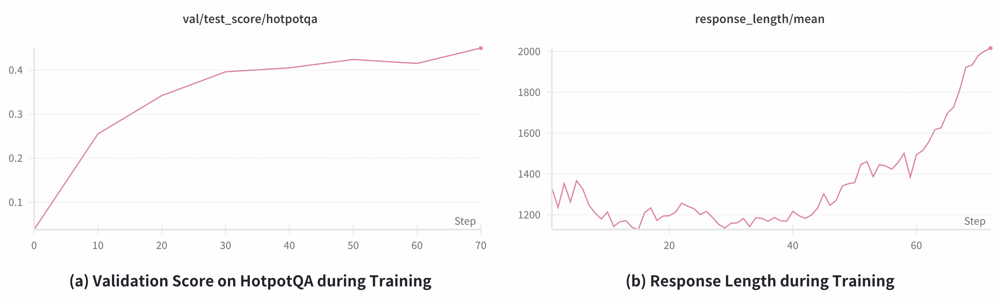

<div align="center">

# ReSearch: Learning to Reason with Search for LLMs via Reinforcement Learning

</div>

Drawing inspiration from the success of [*Deepseek-R1-Zero*](https://arxiv.org/abs/2501.12948) in learning to reason and [*Deep Research*](https://openai.com/index/introducing-deep-research/) from OpenAI, we try to incorporate search operation into the thinking process and train LLMs from scratch using reinforcement learning (i.e., GRPO) from scratch, making LLMs learn to **Re**ason with **Search** (***ReSearch***).

In this repository, we provide the current implementation of ReSearch, and show the results of our pilot experiments. Note that this is a *work in progress*, and we will update the repository with more details and experiments in the future.

The figure below shows the validation scores and response lengths observed during the reinforcement learning process of ReSearch. The training was conducted from scratch using the pre-trained Qwen2.5-7B model and the HotpotQA training set, with GRPO utilizing only exact matches and response format as the reward signal. Finally, *the trained model learns to when and how to invoke the search tool to answer the given question effectively without any supervised data*, solely relying on the reward signal via reinforcement learning. More details can be found below, and a technical report is coming soon.

<div align="center">

</div>

## 📦 Installation

Our implementation primarily builds upon [verl](https://github.com/volcengine/verl) and [FlashRAG](https://github.com/RUC-NLPIR/FlashRAG). For setting up the verl environment, please refer to this [documentation](https://verl.readthedocs.io/en/latest/start/install.html). Note that we utilize `torch==2.4.0+cu124`, `vllm==0.6.3`, and `ray==2.10.0`. For the FlashRAG environment, refer to the installation instructions [here](https://github.com/RUC-NLPIR/FlashRAG?tab=readme-ov-file#wrench-installation).

Install verl
```bash
cd verl && pip3 install -e .
```

Install FlashRAG
```bash
cd flashrag && pip3 install -e .
```

These two environments can be installed independently, as we have decoupled the RAG system from the rollout process in verl, by hosting the RAG system via remote serving.

## 🔄 Reproduce our Experiments

### Host the RAG System (via FlashRAG and FastAPI)

We implement a simple RAG serving for FlashRAG based on FastAPI, which is hosted on a single machine with NVIDIA GPUs. This serving can be used to decouple the RAG system from the reinforcement learning process, making the training process more clear and flexible.

Before starting the RAG serving, you need download the [pre-indexed wikipedia](https://github.com/RUC-NLPIR/FlashRAG?tab=readme-ov-file#index), [wikipedia corpus and corresponding retriever models](https://github.com/RUC-NLPIR/FlashRAG/blob/main/docs/original_docs/reproduce_experiment.md#preliminary). More details can be found in the documentation of FlashRAG.

For starting the RAG serving, you need to first fill the `serving_config.yaml` file with the correct path to the retrieval model, index, and corpus, and available GPU ids.
Then, you can run the following command to start the RAG serving:
```bash
conda activate flashrag  # activate your flashrag environment
python rag_serving/serving.py \
    --config rag_serving/serving_config.yaml \
    --num_retriever {num_retriever} \  
    --port {port}
```

### Train the LLM (via verl)

The model is trained on HotpotQA training set and the validation is conducted on HotpotQA dev set. You can download the HotpotQA dataset from [here](https://hotpotqa.github.io/). The data preprocess script is provided in `training/data_preprocess_hpqa.py`, and it will generate the train and dev data in parquet format.

You can start the training process by running the following command, before running this command, you need to check the arguments in the `run.sh` script and modify them to your own paths and parameters.

```bash
conda activate verl  # your verl environment
bash training/run.sh \
  --actor_model_path {your/model/path} \
  --search_url {your/search/url} \
  --train_data_path {your/train/data/path} \
  --dev_data_path {your/dev/data/path} \
  --wandb_api_key {your-wandb-api-key} \
  --save_path {your/save/path}
```

For simplicity, this training script starts a training process on 1 node with 8 GPUs. If you want to start a training process on multiple nodes, you can use ray to launch the training process in multiple nodes.

### Evaluation (via SGLang and FlashRAG)

When the training is finished, you can use [SGLang](https://docs.sglang.ai/) to serve the trained model. You need to specify the path to the saved model, and an example of launching the model serving is as follows:
```bash
python3 -m sglang.launch_server \
        --served-model-name {saved/model/name} \
        --model-path {saved/model/path} \
        --tp 2 \
        --context-length 8192 \
        --enable-metrics \
        --dtype bfloat16 \
        --host 0.0.0.0 \
        --port 80 \
        --trust-remote-code \
        --disable-overlap \
        --disable-radix-cache
```

We use FlashRAG as the standard RAG evaluation environment. We have implemented the `ReSearchPipeline` in `flashrag/flashrag/pipeline/active_pipeline.py`, and you can use it to evaluate the performance of the trained model directly.

You can run the following command to evaluate the performance of the trained model:
```bash
python evaluation/run_eval.py \
    --config_path evaluation/eval_config.yaml \
    --method_name research \
    --split dev \
    --dataset_name hotpotqa
```

For more details about the configuration, please refer to the `evaluation/eval_config.yaml` file.

## 🧪 Pilot Experiment Results

During the pilot experiment, we train Qwen2.5-7B from scratch with GRPO, on HotpotQA training dataset. We evaluate the performance of the trained model on HotpotQA dev set, Bamboogle and StrategyQA. Note that ReSearch is only trained on HotpotQA training set, and can easily generalize to other datasets.

| Method | HotpotQA | Bamboogle | StrategyQA |
|---|---|---|---|
| Navie-RAG | 31.89	| 20.80	| 63.53 |
| FLARE | 18.97	| 12.00	| 66.02 |
| Iter-RetGen | 33.99	| 19.22	| 64.97	|
| ReSearch | 37.51 | 35.20	| 65.89	|

For baselines (method except ReSearch), we use Qwen2.5-7B-Instruct as their instruction-tuned model, and ReSearch is trained on pre-trained Qwen2.5-7B from scratch. All the experiments are conducted on the same RAG environment.

<details> <summary>An evaluation case on Bamboogle from ReSearch</summary>

Input:
```html
A conversation between User and Assistant. \
The user asks a question, and the assistant solves it. \
The assistant first thinks about the reasoning process in the mind and then provides the user with the answer. \
During thinking, the assistant can invoke the wikipedia search tool to search for fact information about specific topics if needed. \
The reasoning process and answer are enclosed within <think> </think> and <answer> </answer> tags respectively, \
and the search query and result are enclosed within <search> </search> and <result> </result> tags respectively. \
For example, <think> This is the reasoning process. </think> <search> search query here </search> <result> search result here </result> \
<think> This is the reasoning process. </think> <answer> The final answer is \\[ \\boxed{{answer here}} \\] </answer>. \
In the last part of the answer, the final exact answer is enclosed within \\boxed{{}} with latex format. \
User: Who was the first king of the longest Chinese dynasty? Assistant:
```

Output:
```html
<think>
To find the first king of the longest Chinese dynasty, I need to search for information about Chinese dynasties and their durations. I'll look for the dynasty with the longest duration and then find the name of its first king.
</think>
<think>
I'll use a Wikipedia search to find information about Chinese dynasties and their durations.
</think>
<search> "longest chinese dynasty" </search> <result>
Dynasty
during which the family reigned and to describe events, trends, and artifacts of that period (""a Ming-dynasty vase""). The word ""dynasty"" itself is often dropped from such adjectival references (""a Ming vase""). Until the 19th century, it was taken for granted that a legitimate function of a monarch was to aggrandize his dynasty: that is, to increase the territory, wealth, and power of his family members. The longest-surviving dynasty in the world is the Imperial House of Japan, otherwise known as the Yamato dynasty, whose reign is traditionally dated to . Prior to the 20th century, dynasties throughout the world

"History of China"
the Shang dynasty, Western scholars are often hesitant to associate settlements that are contemporaneous with the Anyang settlement with the Shang dynasty. For example, archaeological findings at Sanxingdui suggest a technologically advanced civilization culturally unlike Anyang. The evidence is inconclusive in proving how far the Shang realm extended from Anyang. The leading hypothesis is that Anyang, ruled by the same Shang in the official history, coexisted and traded with numerous other culturally diverse settlements in the area that is now referred to as China proper. The Zhou dynasty (1046 BC to approximately 256 BC) is the longest-lasting dynasty in Chinese

"Family tree of ancient Chinese emperors"
to 256 BC, it is notable as the longest dynasty in Chinese history, although the actual political and military control of China by the dynasty only lasted during the Western Zhou. 東野家族大宗世系翁 Family Tree of the descendants of the Duke of Zhou in Chinese In 771 , a coälition of feudal lords and the Western Rong tribes overthrew King You and drove the Zhou out of the Wei valley. During the following Spring and Autumn and Warring States periods, the major states pursued independent policies and eventually declared full independence claiming the title borne by Zhou rulers. All claimed descent

"Zhou dynasty"
Zhou dynasty The Zhou dynasty or the Zhou Kingdom ( ) was a Chinese dynasty that followed the Shang dynasty and preceded the Qin dynasty. The Zhou dynasty lasted longer than any other dynasty in Chinese history. The military control of China by the royal house, surnamed Ji ( ), lasted initially from 1046 until 771 BC for a period known as the Western Zhou and the political sphere of influence it created continued well into Eastern Zhou for another 500 years. During the Zhou Dynasty, centralized power decreased throughout the Spring and Autumn period until the Warring States period

"History of the Ming dynasty"
divided into thirteen provinces for administrative purposes. These provinces were divided along traditional and to a degree also natural lines. These include Zhejiang, Jiangxi, Huguang, Fujian, Guangdong, Guangxi, Shandong, Henan, Shanxi, Shaanxi, Sichuan, Yunnan and Guizhou. These provinces were vast areas, each being at least as large as England. The longest Ming reign was that of the Wanli Emperor, who ruled for forty eight years. (1572–1620). The shortest was his son's reign, the Taichang Emperor, who ruled for only one month (in 1620). The Mongol-led Yuan dynasty (1279–1368) ruled before the establishment of the Ming dynasty. Alongside institutionalized ethnic discrimination
</result> <think>
From the search result, I can see that the Zhou dynasty is the longest-lasting dynasty in Chinese history. I need to find the first king of the Zhou dynasty.
</think>
<search> "first king of the Zhou dynasty" </search> <result>
"King Wu of Zhou"
King Wu of Zhou King Wu of Zhou () was the first king of the Zhou dynasty of ancient China. The chronology of his reign is disputed but is generally thought to have begun around 1046 BC and ended three years later in 1043 BC. King Wu's ancestral name was Ji () and given name Fa (). He was the second son of King Wen of Zhou and Queen Taisi. In most accounts, his older brother Bo Yikao was said to have predeceased his father, typically at the hands of King Zhou, the last king of the Shang dynasty; in

"King Nan of Zhou"
house of Zhou has been destroyed, [the line of] the Sons of Heaven has been severed. There is no greater turmoil than the absence of the Son of Heaven; without the Son of Heaven, the strong overcome the weak, the many lord it over the few, they use arms to harm each other having no rest."" The title of ""Son of Heaven"" was eventually adopted by Qin Shi Huang, when he proclaimed himself the First Emperor. King Nan of Zhou King Nan of Zhou (?–256 BC), born Ji Yan and less commonly known as King Yin of Zhou, was the

"King Nan of Zhou"
King Nan of Zhou King Nan of Zhou (?–256 BC), born Ji Yan and less commonly known as King Yin of Zhou, was the 37th and last king of the Chinese Zhou dynasty, the son of King Shenjing of Zhou and grandson of King Xian of Zhou. He was king for fifty-nine years, the longest in the Zhou Dynasty and all of pre-imperial China (in terms of the reign length followed by King Mu of Zhou). By the time of King Nan's reign, the kings of Zhou had lost almost all political and military power, as even their remaining crown

"Zhou dynasty"
of concrete regulations, the fragmentation of the Western Zhou period led the ritual to drift towards moralization and formalization in regard to: The rulers of the Zhou dynasty were titled ""Wáng"" (), which is normally translated into English as ""king"" and was also the Shang term for their rulers. In addition to these rulers, King Wu's immediate ancestors Danfu, Jili, and Wen are also referred to as ""Kings of Zhou"", despite having been nominal vassals of the Shang kings. NB: Dates in Chinese history before the first year of the Gonghe Regency in 841 BC are contentious and vary by

"King Wen of Zhou"
King Wen of Zhou King Wen of Zhou (; 1112 1050 BC, the Civilizing King) was count of Zhou during the late Shang dynasty in ancient China. Although it was his son Wu who conquered the Shang following the Battle of Muye, Count Wen was posthumously honored as the founder of the Zhou dynasty and titled King. A large number of the hymns of the ""Classic of Poetry"" are praises to the legacy of King Wen. Some consider him the first epic hero of Chinese history. Born Ji Chang (), Wen was the son of Tairen and Ji Jili, the
</result> <think>
From the search results, I can see that King Wu of Zhou was the first king of the Zhou dynasty. I need to find the first king of the longest Chinese dynasty, which is the Zhou dynasty.
</think>
<answer> \boxed{King Wu of Zhou} </answer>
```
</details>

## 📋️ TODO
- Add more tools besides search
- Integrate code interpreter
- Scale to larger models and more general tasks 

## 🤝 Acknowledge

This implementation is mainly based on [verl](https://github.com/volcengine/verl) and [FlashRAG](https://github.com/RUC-NLPIR/FlashRAG). The serving of RAG system is based on [FastAPI](https://github.com/fastapi/fastapi). The model serving is based on [SGLang](https://docs.sglang.ai/). The base model during the pilot experiment is [Qwen2.5-7B](https://huggingface.co/Qwen/Qwen2.5-7B). We sincerely appreciate their contributions to the open-source community.

## 📚 Contributors and Citation

Contributors: [Mingyang Chen](https://mingyangchen.cn/), [Tianpeng Li](https://scholar.google.com/citations?hl=zh-CN&user=_mzX2mYAAAAJ), [Haoze Sun](https://scholar.google.com/citations?user=OtFoTdQAAAAJ&hl=en), [Yijie Zhou](https://github.com/ZYiJie), [Chengzheng Zhu](https://github.com/Unfinito), [Fan Yang](https://github.com/yangfly), [Zenan Zhou](https://scholar.google.com/citations?user=tZa2hzAAAAAJ&hl=en), [Weipeng Chen](https://scholar.google.com.hk/citations?user=tKPgUmMAAAAJ&hl=zh-CN). 

If you find this work useful, please cite it as follows:
```bibtex
@misc{ReSearch,
  title        = {ReSearch: Learning to Reason with Search for LLMs via Reinforcement Learning},
  author       = {Mingyang Chen, Tianpeng Li, Haoze Sun, Yijie Zhou, Chenzheng Zhu, Fan Yang, Zenan Zhou, Weipeng Chen},
  howpublished = {\url{https://github.com/Agent-RL/ReSearch}},
  year         = {2025}
}
```


